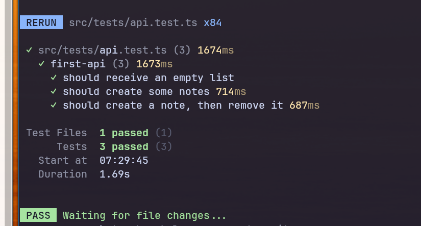

# Your First API (REST)

::: info
In this exercise you will learn:
* How to create a REST API
:::

## Introduction to REST

A REST API, which stands for Representational State Transfer Application Programming Interface, is a set of rules and conventions for building and interacting with web services. It allows different software applications to communicate with each other over the internet by using standard HTTP methods, such as GET (retrieve data), POST (create data), PUT (update data), and DELETE (remove data).

REST APIs are designed around a few key principles:

1. Stateless: Each request from a client to a server must contain all the information needed to understand and process the request. The server doesn't store any information about the client's state between requests.

2. Resources: In a REST API, data is represented as resources, which are identified by unique URLs (Uniform Resource Locators).

3. CRUD Operations: REST APIs typically support the basic CRUD (Create, Read, Update, Delete) operations for manipulating resources.

4. HTTP Verbs: HTTP methods are used to perform actions on resources, such as GET (retrieve data), POST (create data), PUT (update data), and DELETE (remove data).

5. Representations: Resources can have different representations, such as [JSON](https://www.json.org/json-en.html) or [XML](https://en.wikipedia.org/wiki/XML), which allow clients to interact with the data in a format they understand.

REST APIs are widely used for building web services, and they provide a scalable and flexible way for applications to communicate and share data over the internet.

## Exercise

This time you'll have to do some more work. I want you to create a CRUD api for todo-notes. Move into the project folder `cd exercises/first-api` and get to work.

> You're done once you can run the all the test found in the boilerplate project.

Use whatever search engine and/or documentation you can find to make things work. The idea here is to get you up to speed with the AWS tooling and also be able to make use of the broad range of documentation available online.

:::tip
If you get stuck, check out the example folder to get pointed some idea of how you could solve it.
:::

1. Clone the project and move to the boilerplate location 
2. Install the dependencies `pnpm install`
3. Deploy the infrastructure & start development `pnpm dev`
3. Run the tests (`pnpm run test`), your task is to create the required endpoints to make them work. You'll find the API requirements by looking at the tests.
4. Push your solution to your own repository
5. Tell us that your done & let's descuss your provided solution

### Task Details

Add endpoints for each (CRUD) action we want to perform on the `Note` data structure.

| Method | Status     | Response Body |
|---     |---         |---            |
|GET     | 200\|404   | Note          |
|GET     | 200        | Note[]        |
|POST    | 201        | Note          |
|DELETE  | 204        |               |

### Validation
`pnpm run test`

