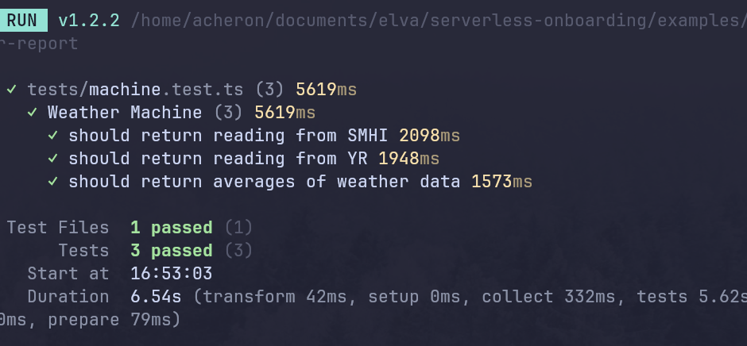
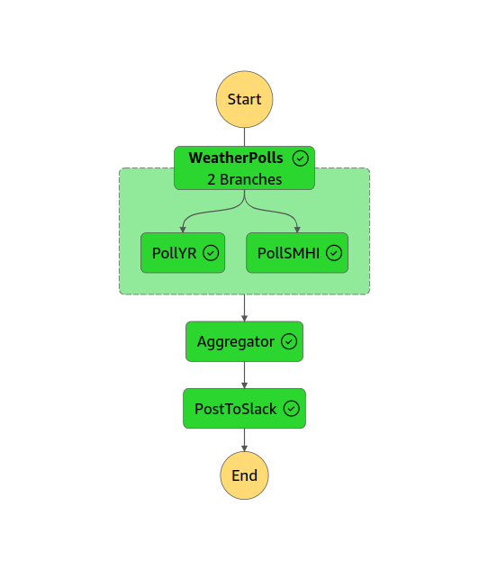

# Building a Weather Report Service

> Task Description: Create a service that collect weather readings from muliple sources and then outputs the mean value(s) to a slack channel

:::tip
Use this (project)[https://github.com/elva-labs/serverless-onboarding/tree/main/exercises/weather-report] as a starting point.
:::

### Overview

Develop a service in TypeScript utilizing the Serverless Stack (SST) framework. The service should communicate with at least two sources and use aws step-functions
as the backbone.

- **Setup**: Use the project located in `~/exercises/level-5/weather-report` as a starting point.
- **Testing**: Run the test that exist in the boiler-project, you are done once they exectue properly.

### Key Requirements

1. **Readings**: Read current temp (or more) from at least two sources.
2. **Result**: Output the resulting mean to a slack channel.

### Technical Specifications

1. **Serverless Framework**: Use `SST` for building and deploying the service.
2. **Programming Language**: `TypeScript` or `Rust`.
3. **A Stepfunction**: The entire process should fit in your state machine.

And your machine should look something like this once your're done

