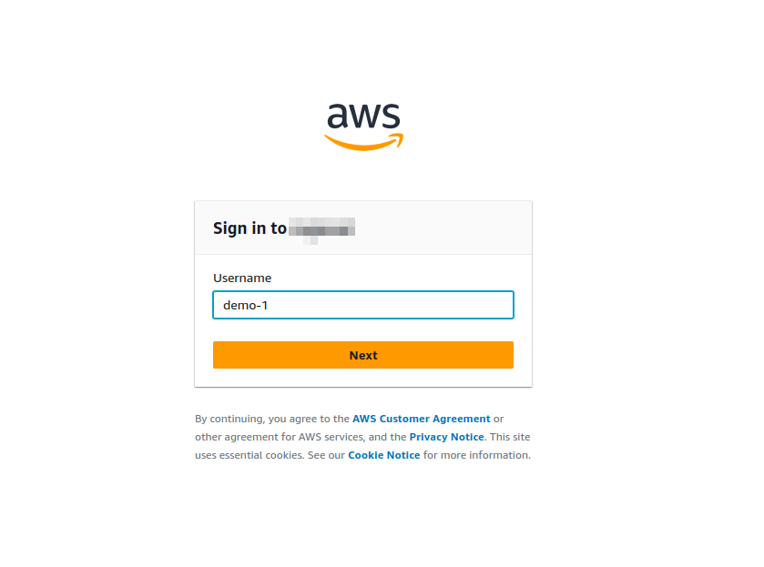
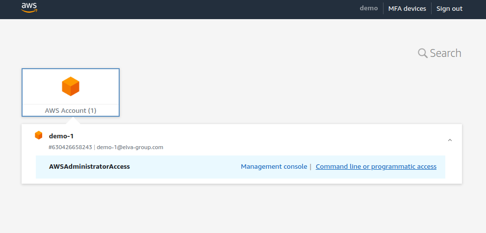
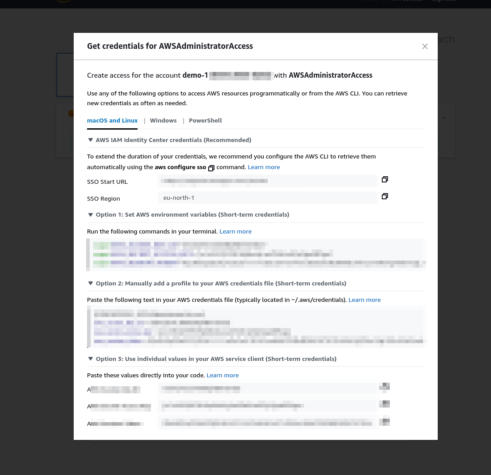

# Account Creation


## SSO Provided by Elva

You will get access to a few different accounts via single sign-on (SSO) provided by Elva. These different accounts are ment to be used for practice and later some production workloads, depending on what you aim to build.

:::tip
By now you should be able to find an invite to AWS (in your elva mail). Follow the instructions in that mail to access your private account.
:::

AWS Single Sign-On (SSO) is a fully managed service by Amazon Web Services (AWS) that simplifies access management for AWS accounts and business applications. AWS SSO allows users to sign in once and access multiple AWS accounts and third-party applications without the need to remember multiple usernames and passwords. 

[Read more](../etc/sso.md)

### Retrieving Access Credentials
> SSO link (`https://<sso-group>.awsapps.com/start/#/`) > AWS Account > Your account > Dropdown >  Command line or programmatic access

#### Sign In



#### Find Your Credentials





Use the credentials in your current shell, by exporing the them as variables (by pasing them directly into the terminal).

```bash
export AWS_ACCESS_KEY_ID="..."
export AWS_SECRET_ACCESS_KEY="..."
export AWS_SESSION_TOKEN="..."
```


Verirfy that you have access:
```bash
$ aws sts get-caller-identity
```

Output:

```json
{
    "UserId": "AROAZFSC3MXBTX5E5PK26:demo-1",
    "Account": "630426658243",
    "Arn": "arn:aws:sts::630426658243:assumed-role/AWSReservedSSO_AWSAdministratorAccess_c24f1c5eb9707aca/demo-1"
}
```

You can assume that you have admin access rights if you see something similary to the output displayed above. If that is the case, you are now ready to create your first assets in the cloud!

## Your Own Private Account
If you want, create your own private account by heading over to [AWS](https://aws.amazon.com/free). Then, follow along in the next sections.


:::tip
When you have some extra time, check out https://www.leapp.cloud/ to easily swap between different accounts (credentials) a bit easier.
:::

#### Retreving Access Credentials

TODO
