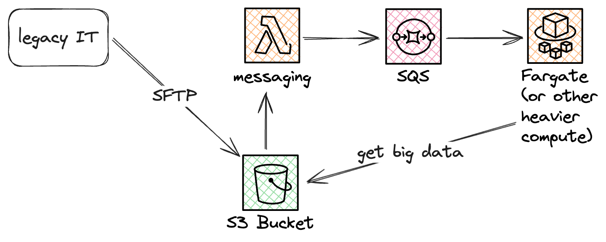

# Claim Check

### Challenge Level: 2

In this challenge, you'll implement the Claim Check pattern. The Claim Check pattern is often used when the data that needs to flow through the system is too big for common event driven services to handle. This is a common occurrence when working with legacy systems.

## Challenge Description

Your task is to design a serverless solution that stores the data that is too large to be transmitted through your messaging system and instead pass a claim check (reference) through the services. The receiving component in the end should then be able to retrieve the full amount of data. This might look very similar to the Storage First pattern because the first step is to store the information before any processing. However in this case it's not just to make sure the user doesn't lose any data it's because the data will not fit the current architecture.

## Technical Requirements

1. Assume you have a file in S3 of notable size (you can use any file when testing this yourself)
2. Add a bucket notification that triggers a Lambda function
3. The lambda function should push an event with information about the item to SQS
4. Some sort of Compute should then poll the SQS
    1. For the purpose of this challenge it can be a lambda
5. The Compute should then fetch the original data from S3 and process it
    1. For the purpose of this challenge you could just print some information about the file

## Architecture

## Hints

::: details Hint 1: Efficient Claim Check Design
When designing your claim check, consider including metadata that might be useful for processing. This could include file type, size, or a hash of the content. This approach can help downstream processes make decisions without needing to retrieve the full data set.
:::

::: details Hint 2: Function and Visibility Timeout
Make sure the visibility timeout of the SQS Queue is shorter than the function timeout if polling the queue from a lambda.
:::

## Resources

- [AWS Lambda Developer Guide](https://docs.aws.amazon.com/lambda/latest/dg/welcome.html)
- [Amazon SQS Developer Guide](https://docs.aws.amazon.com/AWSSimpleQueueService/latest/SQSDeveloperGuide/welcome.html)
- [Amazon S3 Event Notifications](https://docs.aws.amazon.com/AmazonS3/latest/userguide/EventNotifications.html)
- [Using Lambda with Amazon SQS](https://docs.aws.amazon.com/lambda/latest/dg/with-sqs.html)
- [Capturing records of Lambda asynchronous invocations - Adding a dead-letter queue](https://docs.aws.amazon.com/lambda/latest/dg/invocation-async-retain-records.html#invocation-dlq)

## Quiz

<Quiz 
question="What is a primary benefit of using the Claim Check pattern in this scenario?"
:answers="['Increased data security', 'Improved system scalability', 'Faster data processing', 'Enhanced data compression']"
:correctAnswer="1"
:answerInfo="[
  'It\'s not the primary benefit in this context.',
  'Correct! The Claim Check pattern allows systems to handle larger data sets without overwhelming message queues, improving scalability.',
  'The pattern doesn\'t necessarily speed up data processing.',
  'The pattern doesn\'t involve data compression.'
 ]"
/>

<Quiz 
question="In the context of this pattern, what does the 'claim check' typically represent?"
:answers="['A security token', 'A compression algorithm', 'A reference or pointer to the stored data', 'A data validation checksum']"
:correctAnswer="2"
:answerInfo="[
  'A claim check is not primarily a security token.',
  'The pattern doesn\'t involve compression.',
  'Correct! The claim check serves as a reference to the larger data set stored separately.',
  'While it might include a checksum, that\'s not the primary purpose of a claim check.'
 ]"
/>

<Quiz 
question="What potential issue does the Claim Check pattern help mitigate in message-based systems?"
:answers="['Data inconsistency', 'Network latency', 'Message size limitations', 'Data duplication']"
:correctAnswer="2"
:answerInfo="[
  'The pattern doesn\'t directly address data consistency issues.',
  'While it can affect latency, that\'s not the primary issue it addresses.',
  'Correct! The pattern helps overcome message size limitations in messaging systems.',
  'The pattern doesn\'t primarily deal with data duplication.'
 ]"
/>

<Quiz 
question="What is a potential drawback of using the Claim Check pattern?"
:answers="['Increased storage costs', 'Reduced data security', 'Higher system complexity', 'Slower data retrieval']"
:correctAnswer="2"
:answerInfo="[
  'While storage costs might increase, it\'s not typically considered the main drawback.',
  'The pattern can actually improve security when implemented correctly.',
  'Correct! The pattern introduces additional steps and components, increasing overall system complexity.',
  'While retrieval might take an extra step, it\'s not necessarily slower overall.'
 ]"
/>

<Quiz 
question="In a well-implemented Claim Check pattern, what should happen if the original data is not available when the claim check is processed?"
:answers="['The system should crash', 'The message should be discarded', 'The process should retry with exponential backoff', 'A placeholder should be used instead']"
:correctAnswer="2"
:answerInfo="[
  'Crashing the system would create instability and is not a good practice.',
  'Discarding the message could lead to data loss.',
  'Correct! Implementing retry logic with exponential backoff is a robust way to handle temporary unavailability.',
  'Using a placeholder could lead to data integrity issues.'
 ]"
/>
