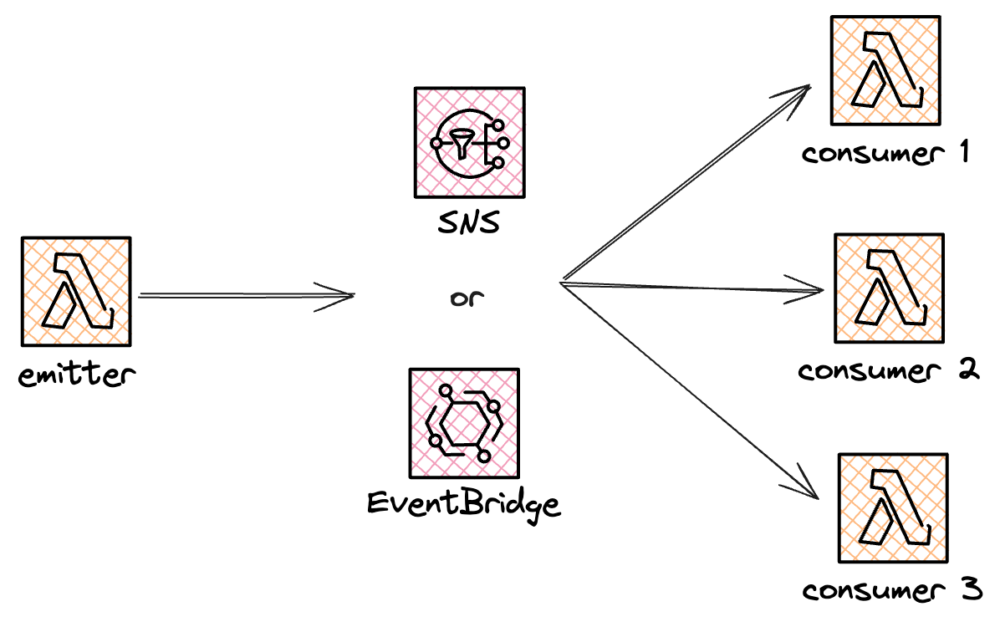

# Fan-Out

### Challenge Level: 2

In this challenge, you'll implement the Fan-out Pattern.
This pattern is essential for distributing messages to multiple consumers in serverless architectures, enabling parallel processing and decoupling of components.

## Challenge Description

Your task is to design a serverless solution that receives messages from a single source and distributes them to multiple downstream services for parallel processing.
You could use either Amazon EventBridge or Amazon SNS as the distribution mechanism.
The solution should be scalable and allow for easy addition or removal of downstream consumers.

## Technical Requirements

1. Create a lambda that will push the event
2. Implement a fan-out mechanism using either EventBridge or SNS
3. Create at least three different downstream consumers
   1. The consumers could just be lambdas for the purpose of this challenge
4. Ensure that each consumer can process messages independently
5. Make it easy to add or remove consumers without affecting the core system

## Architecture

## Hints

::: details Hint 1: Choosing the Right Fan-out Service
EventBridge and SNS offer similar functionalities.
When choosing you should consider the tradeoffs that matter most to your use-case.
For the purpose of this challenge any of them will do fine and we would suggest you to try the one you're least familiar with.

Trade-offs to consider:
- Only EventBridge offers direct SaaS integrations with for example Salesforce.
- EventBridge gives you the ability to use the [Schema Registry]() to discover and generate schemas for different common events.
- SNS support up to 100k topics with 12.5M subscriptions per topic. EventBridge has a limit of a 100 buses and 300 rules per bus.
- EventBridge has built-in input transformation.
- EventBridge has lots of direct integrations with other AWS services. SNS gives you the ability to set targets via HTTPS, SMS, push notifications, email, SQS and Lambda functions.
- SNS has FIFO (first in first out) capabilites.
- SNS has exponential backoff up to 23 days while EventBridge has up to 24 hours.
:::

::: details Hint 2: Handling Partial Failure
In a fan-out scenario, some consumers might fail while others succeed.
Consider how you would handle partial failures.
For example:
- Implement robust error handling in each consumer
- Consider using Dead Letter Queues (DLQs) for failed messages
- Implement a monitoring solution to track the success/failure of each consumer
:::

::: details Hint 3: Filter Messages
The subscriber on a topic can optionally add a message filter which limits what kind of messages that subscriber receives.
This is an efficient way to have several subscribers on the same topic only react on the message that matters for them.
:::

## Resources

- [Amazon EventBridge Developer Guide](https://docs.aws.amazon.com/eventbridge/latest/userguide/what-is-amazon-eventbridge.html)
- [Amazon SNS Developer Guide](https://docs.aws.amazon.com/sns/latest/dg/welcome.html)
- [AWS Lambda Developer Guide](https://docs.aws.amazon.com/lambda/latest/dg/welcome.html)
- [Choosing Between Messaging Services - AWS Blog](https://aws.amazon.com/blogs/compute/choosing-between-messaging-services-for-serverless-applications/)

## Quiz

<Quiz 
  question="What is the main benefit of the Fan-out Pattern?"
  :answers="['Increased security', 'Parallel processing of messages', 'Reduced costs', 'Simplified architecture']"
  :correctAnswer="1"
  :answerInfo="[
    'This is not the main benefit of the Fan-out Pattern.',
    'Correct! The Fan-out Pattern allows multiple consumers to process messages in parallel, improving scalability and performance.',
    'This is not the main benefit of the Fan-out Pattern.',
    'The Fan-out Pattern may actually add some complexity to the architecture, but the benefits often outweigh this.'
    ]"
/>

<Quiz 
  question="What is a key consideration when implementing error handling in a Fan-out Pattern?"
  :answers="['Ignoring all errors', 'Stopping all consumers if one fails', 'Handling partial failures', 'Reducing the number of consumers']"
  :correctAnswer="2"
  :answerInfo="[
  'Ignoring all errors is not a good practice you silly goose.',
  'Stopping all consumers when one fails defeats the purpose of the Fan-out Pattern and reduces system resilience.',
  'Correct! In a Fan-out Pattern, it\'s important to handle partial failures where some consumers might fail while others succeed. This ensures overall system resilience.',
  'Reducing the number of consumers is not a solution to error handling and goes against the scalability benefits of the Fan-out Pattern.'
  ]"
/>

<Quiz 
  question="Which feature can help improve scalability when using SNS in a Fan-out Pattern?"
  :answers="['SNS FIFO Topics', 'SNS Standard Topics', 'SQS Queues in front of Lambda consumers', 'SNS Message Filtering']"
  :correctAnswer="2"
  :answerInfo="[
  'While SNS FIFO Topics ensure ordered message delivery, they don\'t necessarily improve scalability in a Fan-out Pattern.',
  'SNS Standard Topics are used in Fan-out Patterns, but this answer doesn\'t specifically address improving scalability.',
  'Correct! Using SQS Queues in front of Lambda consumers can improve scalability and resilience in a Fan-out Pattern by decoupling the rate of message production from consumption.',
  'SNS Message Filtering can help reduce unnecessary processing, but it doesn\'t directly improve scalability in the way the question is asking.'
  ]"
/>

## Additional Reading

* Yan has a great blog about the [push-pull messaging pattern](https://theburningmonk.com/2018/04/how-to-do-fan-out-and-fan-in-with-aws-lambda/) where he uses fan-in and fan-out
* Benoit Paul also writes about the [fan-out pattern and goes in depth about using SQS to handle errors](https://www.benoitpaul.com/blog/aws/sns-sqs-fanout/) as well as touching on filtering messages by attribute on the SNS topic
