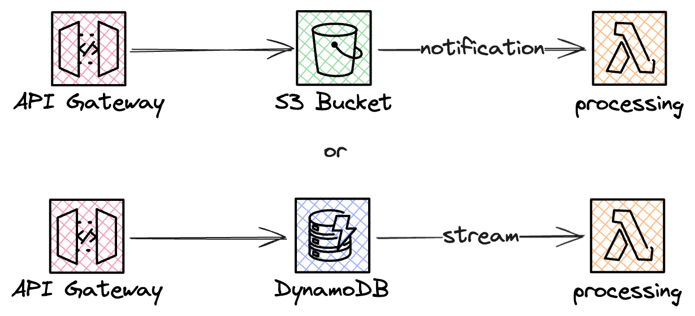

# The Storage First Pattern

### Challenge Level: 1

In this challenge, you'll implement the Storage First Pattern. This pattern is crucial for ensuring reliable message processing in serverless architectures, especially when dealing with high-volume or critical data ingestion scenarios.

## Challenge Description

Your task is to design a serverless solution that immediately stores incoming messages in a durable storage service before any processing occurs. You should handle this with for example an API Gateway direct integration. For the purpose of this challenge you could use either S3 or DynamoDB as the storage and then process it with a Lambda function.

## Technical Requirements

1. Set up an API Gateway to receive incoming messages
2. Implement direct integration from API Gateway to a durable storage service (e.g., S3 or DynamoDB)
3. Configure a Lambda function to be triggered when new data is stored
4. The Lambda function should process the stored data
  a. For the purpose of this guide it could print the message
5. Implement error handling and retry logic for failed message processing
6. Ensure no loss of data, even if processing fails

## Architecture

## Hints

::: details Hint 1: Choosing the Right Storage Service
Consider the nature of your data when selecting a storage service:
- Use S3 for larger objects or when you need to store raw request payloads
- Use DynamoDB for structured data that requires fast, frequent access
Remember, the goal is to store the data as quickly and durably as possible before acknowledging the request.
:::

::: details Hint 2: API Gateway Direct Integration
API Gateway supports direct integrations with AWS services like S3 and DynamoDB. This allows you to store data without going through a Lambda function, reducing latency and potential points of failure. Explore the AWS documentation on API Gateway service integrations to implement this efficiently.
:::

::: details Hint 3: Asynchronous Processing
You should implement event-driven architectures to trigger your processing Lambda:
- S3 can trigger Lambda directly using S3 event notifications
- DynamoDB Streams can be used with DynamoDB to capture changes and trigger Lambda
This approach allows for scalable and efficient processing of stored messages.
:::

::: details Hint 4: Error Handling and Retry
You can implement robust error handling using Lambda Destinations:
- Configure an SQS queue as an "on failure" destination for your processing Lambda
- Set up another Lambda function to process messages from this SQS queue (redrive function)
- Consider implementing exponential backoff in your retry logic to handle transient failures
:::

## Resources

- [Amazon API Gateway Developer Guide](https://docs.aws.amazon.com/apigateway/latest/developerguide/welcome.html)
- [Amazon S3 Developer Guide](https://docs.aws.amazon.com/AmazonS3/latest/dev/Welcome.html)
- [Amazon DynamoDB Developer Guide](https://docs.aws.amazon.com/amazondynamodb/latest/developerguide/Introduction.html)
- [AWS Lambda Developer Guide](https://docs.aws.amazon.com/lambda/latest/dg/welcome.html)

## Quiz

<Quiz 
  question="What is the main benefit of the Storage First Pattern?"
  :answers="['Faster message processing', 'Guaranteed message delivery', 'Reduced costs', 'Simplified architecture']"
  :correctAnswer="1"
  :answerInfo="[
    'While it can potentially improve processing speed in some scenarios, this is not the main benefit of the Storage First Pattern.',
    'Correct! The Storage First Pattern ensures that messages are stored durably before processing, guaranteeing that no messages are lost even if processing fails.',
    'While it can potentially reduce costs in some scenarios, this is not the main benefit of the Storage First Pattern.',
    'The Storage First Pattern may actually add some complexity to the architecture, but the benefits often outweigh this.'
    ]"
/>

<Quiz 
  question="What AWS feature can be used to automatically trigger a Lambda function when a new object is added to S3?"
  :answers="['S3 Event Notifications', 'S3 Lifecycle Policies', 'S3 Replication', 'S3 Versioning']"
  :correctAnswer="0"
  :answerInfo="[
    'Correct! S3 Event Notifications can be configured to automatically trigger a Lambda function when new objects are added to a bucket.',
    'S3 Lifecycle Policies are used for managing the lifecycle of objects in S3, not for triggering Lambda functions.',
    'S3 Replication is used for copying objects between buckets, not for triggering Lambda functions.',
    'S3 Versioning is used for keeping multiple versions of an object, not for triggering Lambda functions.'
    ]"
/>

<Quiz 
  question="Which feature of DynamoDB can be used to trigger a Lambda function when data is added or modified?"
  :answers="['DynamoDB Accelerator (DAX)', 'DynamoDB Streams', 'DynamoDB Global Tables', 'DynamoDB Transactions']"
  :correctAnswer="1"
  :answerInfo="[
  'DAX is an in-memory cache for DynamoDB, not a triggering mechanism.',
  'Correct! DynamoDB Streams can capture table activity and trigger Lambda functions in response to data modifications.',
  'Global Tables is a multi-region replication feature, not related to triggering Lambda functions.',
  'Transactions ensure the atomicity of operations but don\'t provide a mechanism for triggering Lambda functions.'
  ]"
/>

<Quiz 
  question="In the context of Lambda redrive for error handling, what does 'exponential backoff' refer to?"
  :answers="['Increasing the Lambda function timeout exponentially', 'Reducing the number of retries exponentially', 'Increasing the delay between retry attempts', 'Exponentially increasing the Lambda memory allocation']"
  :correctAnswer="2"
  :answerInfo="[
  'Exponential backoff doesn\'t involve changing the Lambda function timeout.',
  'Exponential backoff actually involves increasing, not reducing, something related to retries.',
  'Correct! Exponential backoff refers to progressively increasing the delay between retry attempts. This helps to avoid overwhelming the system and allows time for transient issues to resolve.',
  'Exponential backoff doesn\'t involve changing the Lambda memory allocation.'
  ]"
/>

## Additional Reading

* Jimmy Dahlqvist has written about storage first in his [Serverless Patterns post](https://jimmydqv.com/serverless-patterns/)
