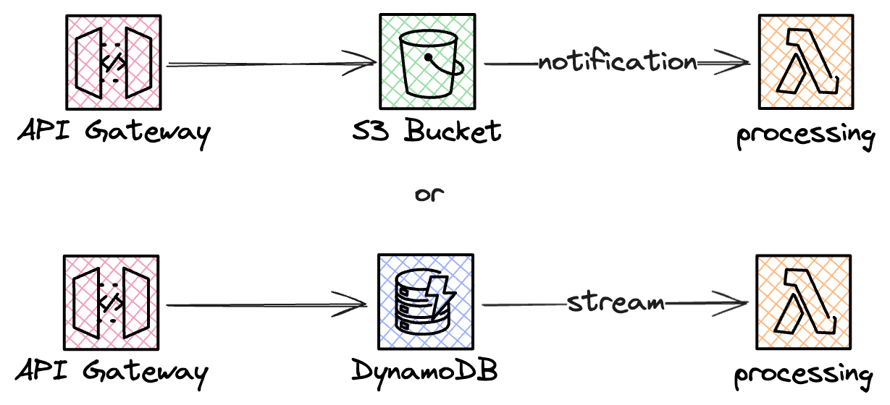

# Storage First

### Challenge Level: 1

In this challenge, you'll implement the Storage First Pattern.
This pattern is crucial for ensuring reliable message processing in serverless architectures, especially when dealing with high-volume or critical data ingestion scenarios.
It gives you the ability to reprocess (or redrive) the raw data and it makes sure that no loss of data happens before any processing fails.

## Challenge Description

Your task is to design a serverless solution that immediately stores incoming messages before any processing occurs. You could handle this with for example an API Gateway direct integration. For the purpose of this challenge you could use either S3, SQS or DynamoDB as the storage and then process it with a Lambda function.

## Technical Requirements

1. Set up an API Gateway to receive incoming messages
2. Implement direct integration from API Gateway to a storage service
3. Configure a Lambda function to be triggered when new data is stored
4. The Lambda function should process the stored data
    * For the purpose of this guide it could print the message
5. Ensure no loss of data, even if processing fails
6. (Optional) Redrive data that fails processing

## Architecture

## Hints

::: details Hint 1: REST or HTTP API Gateway?
API Gateway offers a few different variants of gateways and the two most common ones are REST and HTTP gateways.
HTTP APIs are missing a few key features.
For instance HTTP APIs do not have the ability to attach a WAF, use API keys to protect the endpoint nor caching.
But if these are not features you need then HTTP APIs can be a good choice since they're significantly cheaper.
Moving from an HTTP API to a REST API is not hard, should you "outgrow" them.
To figure out which one you want you can read the page [Choose between REST APIs and HTTP APIs](https://docs.aws.amazon.com/apigateway/latest/developerguide/http-api-vs-rest.html).
:::

::: details Hint 2: Choosing the Right Storage Service
When selecting storage service you should consider the use case.
If the API endpoint prone to getting large surges of data that you want to evenly handle then SQS is a good option.
If you want to be able to query the semi- or unstructured data later on then S3 is a good option.
If there is an immediate use of the structured data or the incoming data is highly structured then DynamoDB becomes a good option.
:::

::: details Hint 3: Look at an example if stuck
We have an example for this challenge over [here](https://github.com/elva-labs/braincells/tree/main/examples/serverless-challenges/event-driven/storage-first).
:::

## Resources

- [Amazon API Gateway Developer Guide](https://docs.aws.amazon.com/apigateway/latest/developerguide/welcome.html)
- [Amazon S3 Developer Guide](https://docs.aws.amazon.com/AmazonS3/latest/dev/Welcome.html)
- [Amazon DynamoDB Developer Guide](https://docs.aws.amazon.com/amazondynamodb/latest/developerguide/Introduction.html)
- [AWS Lambda Developer Guide](https://docs.aws.amazon.com/lambda/latest/dg/welcome.html)
- [Choose between REST APIs and HTTP APIs](https://docs.aws.amazon.com/apigateway/latest/developerguide/http-api-vs-rest.html)

## Quiz

<Quiz 
  question="What is the main benefit of the Storage First Pattern?"
  :answers="['Faster message processing', 'Guaranteed message delivery', 'Reduced costs', 'Simplified architecture']"
  :correctAnswer="1"
  :answerInfo="[
    'While it can potentially improve processing speed in some scenarios, this is not the main benefit of the Storage First Pattern.',
    'Correct! The Storage First Pattern ensures that messages are stored durably before processing, guaranteeing that no messages are lost even if processing fails.',
    'While it can potentially reduce costs in some scenarios, this is not the main benefit of the Storage First Pattern.',
    'The Storage First Pattern may actually add some complexity to the architecture, but the benefits often outweigh this.'
    ]"
/>

<Quiz 
  question="What AWS feature can be used to automatically trigger a Lambda function when a new object is added to S3?"
  :answers="['S3 Event Notifications', 'S3 Lifecycle Policies', 'S3 Replication', 'S3 Versioning']"
  :correctAnswer="0"
  :answerInfo="[
    'Correct! S3 Event Notifications can be configured to automatically trigger a Lambda function when new objects are added to a bucket.',
    'S3 Lifecycle Policies are used for managing the lifecycle of objects in S3, not for triggering Lambda functions.',
    'S3 Replication is used for copying objects between buckets, not for triggering Lambda functions.',
    'S3 Versioning is used for keeping multiple versions of an object, not for triggering Lambda functions.'
    ]"
/>

<Quiz 
  question="Which feature of DynamoDB can be used to trigger a Lambda function when data is added or modified?"
  :answers="['DynamoDB Accelerator (DAX)', 'DynamoDB Streams', 'DynamoDB Global Tables', 'DynamoDB Transactions']"
  :correctAnswer="1"
  :answerInfo="[
  'DAX is an in-memory cache for DynamoDB, not a triggering mechanism.',
  'Correct! DynamoDB Streams can capture table activity and trigger Lambda functions in response to data modifications.',
  'Global Tables is a multi-region replication feature, not related to triggering Lambda functions.',
  'Transactions ensure the atomicity of operations but don\'t provide a mechanism for triggering Lambda functions.'
  ]"
/>

## Additional Reading

* Jimmy Dahlqvist has written about storage first in his [Serverless Patterns post](https://jimmydqv.com/serverless-patterns/)
