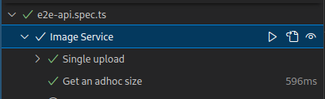

# Building a Image Service

> Task Description: Image Upload and Transformation Service using SST and TypeScript

:::tip
Use this [project](https://github.com/elva-labs/braincells/tree/main/exercises/image-service) as a starting point.
:::

### Overview

Develop a service in TypeScript utilizing the Serverless Stack (SST) framework. The service should allow users to upload a single image via an API (per request). On transformation completion, the user receives an email notification with links to the uploaded image in three different resolution formats.

Additionally, the service should provide on-demand image transformation capabilities, caching the transformed images for future requests. User-specific default transformations will be stored in an AWS DynamoDB table.

### Key Features

1. **Image Upload**: Users can upload a single image through the API.
2. **Email Notification**: Once the images are ready, the user should receive an email with links to the image in three resolutions.

3. **On-Demand Image Transformation**:

   - Allow users to request specific image transformations (e.g., resizing, cropping) for at least one variant.
   - Cache these transformations to optimize response time for subsequent requests.

4. **User-Specific Transformation Defaults**:
   - Store default image transformations for each user in DynamoDB.
   - Apply these defaults automatically to new uploads.

### Technical Specifications

1. **Serverless Framework**: Use `SST` for building and deploying the service.
2. **Programming Language**: `TypeScript` or `Rust`.

3. **Storage**:

   - Use AWS S3 for storing original and transformed images.
   - Implement AWS DynamoDB for storing user preferences and default transformations.

4. **Email Service**: Integrate with AWS SES or a similar email service for sending notifications.

5. **API Endpoints**:

| Method | Path        | Status | Response Body    | Outcome                                                  |
| ------ | ----------- | ------ | ---------------- | -------------------------------------------------------- |
| PUT    | /images     | 200    | Void             | Upload a new image                                       |
| GET    | /images/:id | 200    | Presigned S3 URL | On-demand transformations for an already uploaded image. |
| DELETE | /images/:id | 204    | Void             | Remove all assets related to the given image id.         |

For example, you should support the following api:

#### Upload

```bash
curl -X PUT -F "image=@tests/testImages/check.png" <endpoint>/images | jq
#{
#  "image": "09602343-80aa-4e87-b71f-2c71f61f1040"
#}

```

#### Read

```bash
# Original
curl -L <endpoint>/images/09602343-80aa-4e87-b71f-2c71f61f1040 --output tmp.png

# Dynamic Sizing
curl -L <endpoint>/images/09602343-80aa-4e87-b71f-2c71f61f1040\?w\=150\&h\=150 --output tmp.png
```

### Development Steps

1. **Setup**: Initialize the SST project with TypeScript. Set up AWS services (S3, DynamoDB, SES) using SST and/or CDK.

2. **API Development**: Create RESTful endpoints for image upload, transformation, and retrieval.

3. **Image Processing**: Implement the logic for image transformation.

4. **Email Integration**: Set up the email service to send notifications post-upload.

5. **Testing**: Run the test that exist in the boiler-project, you are done once they exectue properly.

Once your're done you should be able to run the end-to-end tests using `pnpm run test`


