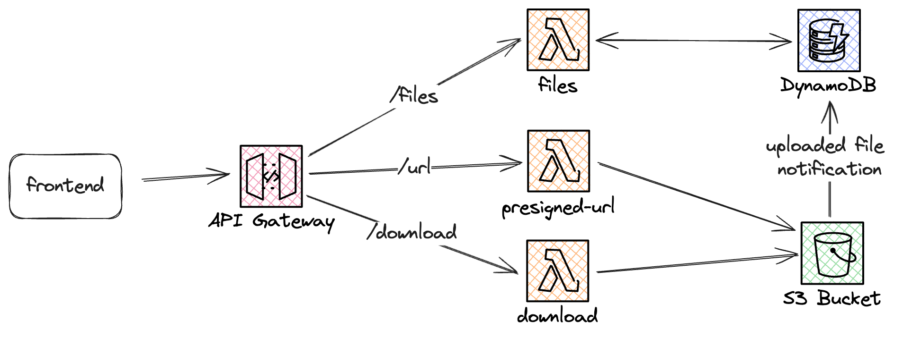

# Store and serve large media files

### Challenge Level: 5

In this challenge, you'll implement a serverless solution to handle large media files. This pattern is often used when dealing with for example images or videos that need to be stored securely and served efficiently. It's a common requirement in modern web and mobile applications.

## Challenge Description

Your task is to design a serverless solution that allows users to upload large media files (such as images or videos) to Amazon S3 and then serve these files to others. You'll need to implement secure upload mechanisms, manage file metadata, and create a way to retrieve and display the uploaded files. This approach uses Pre-signed S3 urls for both up- and download as well as manages metadata with DynamoDB.

## Technical Requirements

1. Set up an S3 bucket to store user-uploaded media files
2. Make sure the bucket is not publicly available
3. Implement a serverless API to handle file uploads
4. Generate pre-signed URLs for secure direct uploads to S3
5. Store metadata about uploaded files (e.g., filename, size, upload date) in DynamoDB
6. Create an API endpoint to retrieve a list of uploaded files
7. Implement a method to generate pre-signed URLs for downloading/viewing files

## Architecture

## Hints

::: details Hint 1: Generating URLs
Use the AWS SDK in your Lambda function to generate pre-signed URLs for both uploads and downloads. This allows for secure, temporary access to S3 objects without making the bucket public.
:::

::: details Hint 2: Metadata Management
Consider using S3 Bucket notifications with Lambda to automatically update metadata when new files are added to S3 or when files are deleted.
:::

::: details Hint 3: Look at an example if stuck
We have an example for this challenge over [here](https://github.com/elva-labs/braincells/tree/main/examples/serverless-challenges/data-persistance-and-storage/store-and-serve-large-media-files).
:::

## Resources

- [Amazon S3 Developer Guide](https://docs.aws.amazon.com/AmazonS3/latest/dev/Welcome.html)
- [Uploading Objects Using Pre-signed URLs](https://docs.aws.amazon.com/AmazonS3/latest/dev/PresignedUrlUploadObject.html)
- [Amazon API Gateway Developer Guide](https://docs.aws.amazon.com/apigateway/latest/developerguide/welcome.html)
- [AWS Lambda Developer Guide](https://docs.aws.amazon.com/lambda/latest/dg/welcome.html)
- [Amazon DynamoDB Developer Guide](https://docs.aws.amazon.com/amazondynamodb/latest/developerguide/Introduction.html)

## Quiz

<Quiz 
  question="Which AWS service is best suited for storing large media files in this scenario?"
  :answers="['Amazon EBS', 'Amazon S3', 'Amazon EFS', 'Amazon RDS']"
  :correctAnswer="1"
  :answerInfo="[
    'Amazon EBS is primarily used for block-level storage volumes for EC2 instances, not ideal for storing and serving large media files.',
    'Correct! Amazon S3 is designed for scalable object storage, making it perfect for storing and serving large media files.',
    'Amazon EFS is a file storage service for EC2 instances, more suited for shared file systems than large media storage.',
    'Amazon RDS is a relational database service, not suitable for storing large media files.'
    ]"
/>

<Quiz 
  question="What's the purpose of using pre-signed URLs in this challenge?"
  :answers="['To make the S3 bucket public', 'To avoid using API Gateway', 'To provide secure, temporary access to S3 objects', 'To reduce Lambda cold starts']"
  :correctAnswer="2"
  :answerInfo="[
    'Making the S3 bucket public would be a security risk and is not the purpose of pre-signed URLs.',
    'Pre-signed URLs are not related to avoiding API Gateway usage.',
    'Correct! Pre-signed URLs provide secure, temporary access to S3 objects without making the bucket public.',
    'Pre-signed URLs do not affect Lambda cold starts.'
    ]"
/>

<Quiz 
  question="Which service would you use to store queryable metadata about the uploaded files?"
  :answers="['Amazon S3', 'Amazon RDS', 'Amazon DynamoDB', 'AWS Glue Data Catalog']"
  :correctAnswer="2"
  :answerInfo="[
    'While S3 can store some metadata, it\'s not ideal for complex or queryable metadata storage.',
    'RDS could be used, but it\'s overkill for simple metadata and doesn\'t scale as well as other options.',
    'Correct! DynamoDB is ideal for storing and quickly retrieving metadata about uploaded files.',
    'AWS Glue Data Catalog is more suited for managing metadata for data lakes, not for individual file metadata.'
    ]"
/>

<Quiz 
  question="What AWS service is used to create a serverless API in this architecture?"
  :answers="['Amazon EC2', 'Amazon ECS', 'Amazon API Gateway', 'Amazon Route 53']"
  :correctAnswer="2"
  :answerInfo="[
    'EC2 is not serverless and requires managing servers.',
    'ECS is for container orchestration, not for creating APIs.',
    'Correct! API Gateway is used to create, publish, and manage APIs in a serverless architecture.',
    'Route 53 is a DNS service, not used for creating APIs.'
    ]"
/>

<Quiz 
  question="Which AWS service is used for executing serverless code in this solution?"
  :answers="['Amazon EC2', 'AWS Lambda', 'Amazon ECS', 'AWS Fargate']"
  :correctAnswer="1"
  :answerInfo="[
    'EC2 requires managing servers and is not a serverless solution.',
    'Correct! AWS Lambda is designed for executing serverless code in response to events.',
    'ECS is for container orchestration, not serverless code execution.',
    'Fargate is for running containers without managing servers, but it\'s not used for simple serverless code execution like Lambda.'
    ]"
/>

## Additional Reading

