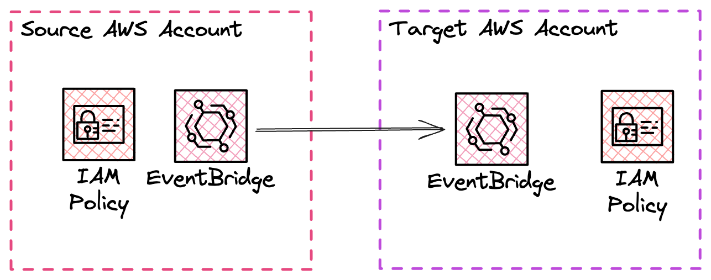

# Cross Account Events

### Challenge Level: 3

In this challenge, you'll implement Cross Account Events using Amazon EventBridge. This pattern is useful when you need to share events between different AWS accounts, allowing for more flexible and scalable architectures in multi-account environments.

## Challenge Description

Your task is to design a serverless solution that enables event sharing between two different AWS accounts using Amazon EventBridge. You'll set up an EventBridge bus in one account (the source account) with a policy that allows it to push events to an EventBridge bus in another AWS account (the target account). This setup enables cross-account event communication, which is crucial for various scenarios such as centralized logging, multi-account architectures, and segregation of concerns.

## Technical Requirements

::: warning You need two AWS accounts for this challenge
This challenge is all about cross-account access. You could do this in a single account as well but we recommend you to try this challenge with two AWS accounts to get hands-on experience with the real challenge of orchestrating such a set up.
:::

1. Set up two AWS accounts: a source account and a target account.
2. In the source account:
    1. Create an EventBridge bus
    2. Configure a rule to capture specific events
    3. Set up a policy on the event bus to allow pushing events to the target account
3. In the target account:
    1. Create an EventBridge bus
    2. Configure a rule to process events from the source account
    3. Set up a policy to allow receiving events from the source account
4. Test the setup by generating an event in the source account and verifying it's received and processed in the target account

## Architecture

## Hints

::: details Hint 1: EventBridge Bus Policy
When setting up the EventBridge bus policy in the source account, make sure to specify the ARN of the target account's event bus in the resource section of the policy. This allows EventBridge to route events to the correct destination.
:::

::: details Hint 2: Event Pattern Matching
Use event pattern matching in your EventBridge rules to filter events effectively. This ensures that only relevant events are sent across accounts, reducing unnecessary data transfer and processing.
:::

::: details Hint 3: IAM Roles and Permissions
Ensure that the IAM roles in both accounts have the necessary permissions to interact with EventBridge. In the source account, you need permissions to put events on the bus, and in the target account, you need permissions to receive and process events.
:::

## Resources

- [Amazon EventBridge User Guide](https://docs.aws.amazon.com/eventbridge/latest/userguide/eb-what-is.html)
- [AWS Identity and Access Management User Guide](https://docs.aws.amazon.com/IAM/latest/UserGuide/introduction.html)
- [Sending and receiving Amazon EventBridge events between AWS accounts](https://docs.aws.amazon.com/eventbridge/latest/userguide/eb-cross-account.html)
- [Amazon EventBridge event patterns](https://docs.aws.amazon.com/eventbridge/latest/userguide/eb-event-patterns.html)
- [Using resource-based policies for Amazon EventBridge](https://docs.aws.amazon.com/eventbridge/latest/userguide/eb-use-resource-based.html)

## Quiz

<Quiz 
  question="What is a primary benefit of using Cross Account Events with EventBridge?"
  :answers="['Increased data storage capacity', 'Improved event processing speed', 'Enhanced multi-account communication', 'Reduced AWS costs']"
  :correctAnswer="2"
  :answerInfo="[
  'Cross Account Events don\'t directly increase storage capacity.',
  'While it can streamline processes, it doesn\'t necessarily improve processing speed.',
  'Correct! Cross Account Events enable seamless communication between different AWS accounts, enhancing multi-account architectures.',
  'While it can optimize architectures, cost reduction isn\'t the primary benefit.'
  ]"
/>

<Quiz 
  question="In a Cross Account Events setup, what does the EventBridge bus policy in the source account primarily define?"
  :answers="['Event data structure', 'Event processing rules', 'Permission to send events to another account', 'Event retention period']"
  :correctAnswer="2"
  :answerInfo="[
  'The bus policy doesn\'t define the event data structure.',
  'Event processing rules are defined separately from the bus policy.',
  'Correct! The bus policy in the source account defines permissions to send events to the specified target account.',
  'Event retention is not typically defined in the bus policy.'
  ]"
/>

<Quiz 
  question="What potential issue should you be aware of when implementing Cross Account Events?"
  :answers="['Increased data latency', 'Potential security risks if not configured correctly', 'Limited event size', 'Incompatibility with certain AWS services']"
  :correctAnswer="1"
  :answerInfo="[
  'Cross-account event routing typically doesn\'t significantly increase latency.',
  'Correct! Improper configuration of policies and permissions can potentially create security vulnerabilities.',
  'EventBridge has a standard event size limit, but it\'s not specific to cross-account scenarios.',
  'Cross Account Events are generally compatible with AWS services that can interact with EventBridge.'
  ]"
/>

<Quiz 
  question="In a Cross Account Events setup, what role does event pattern matching play?"
  :answers="['It encrypts the event data', 'It filters which events are sent across accounts', 'It transforms event data', 'It schedules event delivery']"
  :correctAnswer="1"
  :answerInfo="[
  'Event pattern matching doesn\'t handle encryption.',
  'Correct! Event pattern matching is used to filter events, ensuring only relevant ones are sent across accounts.',
  'While it can influence which data is sent, it doesn\'t transform the data itself.',
  'Event pattern matching doesn\'t handle scheduling of events.'
  ]"
/>
