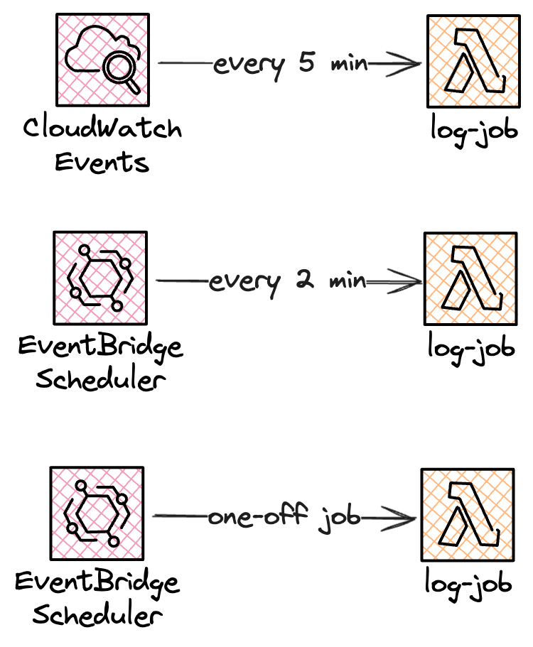

<script setup>
import Quiz from "../../components/Quiz.vue"
</script>

# Scheduled Jobs

### Challenge Level: 2

In this challenge, you'll explore and implement various approaches to setting up and managing serverless cron jobs. Scheduled tasks are important in many applications, and serverless architectures offer flexible and scalable ways to handle them.

## Challenge Description

Your task is to set up three serverless cron jobs:

1. Using CloudWatch Events with Lambda: Create a job that runs every 5 minutes.
2. Using Amazon EventBridge Scheduler: Create a recurring job that runs every 2 minutes.
3. Using Amazon EventBridge Scheduler: Create a one-time job that runs at a specific date and time in a particular time zone.

Each job should perform a simple task, such as logging a timestamp or incrementing a counter in DynamoDB.

## Technical Requirements

1. Implement a cron job using CloudWatch Events and Lambda:
   1. Create a Lambda function that performs a simple task (e.g., logging a timestamp)
   2. Set up a CloudWatch Event rule to trigger this function every 5 minutes
   3. Use a cron expression for scheduling
2. Implement a recurring cron job using Amazon EventBridge Scheduler:
   1. Create another Lambda function for a simple task
   2. Set up EventBridge Scheduler to trigger this function every 2 minutes
   3. Use a rate expression for scheduling
3. Implement a one-time job using Amazon EventBridge Scheduler:
   1. Create a Lambda function for a one-time task
   2. Schedule it to run at a specific date and time in a non-UTC time zone
4. Implement basic error handling and logging for all jobs
5. Create a simple CloudWatch dashboard to monitor the execution of your cron jobs
6. Implement a way to manually trigger each job for testing purposes (e.g., using AWS CLI)
7. Document the steps you took to set up each job and note the differences in the process and capabilities

## Architecture



## Hints

::: details Hint 1: Declare CloudWatch Events in-line
In some IaC frameworks like SAM or Serverless Framework you can set up a cron job with CloudWatch Events directly on the function configuration.
For example in SAM it looks like this:
```yaml
  FiveMinuteJob:
    Type: AWS::Serverless::Function
    Properties:
      Handler: index.handler
      Runtime: nodejs18.x
      Events:
        ScheduleEvent:
          Type: Schedule
          Properties:
            Schedule: rate(5 minutes)
            Name: five-minute-job
            Description: Runs every 5 minutes using CloudWatch Events
            Enabled: true
```

Contrary, EventBridge Scheduler schedules need to be set up independently and target the function in question.
:::

::: details Hint 1: CloudWatch Events with Lambda (The "Old Way")
- Use the AWS Management Console, AWS CLI, or AWS SDK to create the CloudWatch Event rule
- The cron expression for a job running every 5 minutes would be `cron(0/5 * * * ? *)`
- Note that CloudWatch Events are always in UTC time zone
- CloudWatch Events have limitations in scheduling flexibility compared to EventBridge Scheduler
:::

::: details Hint 2: EventBridge Scheduler Recurring Job
- For a job running every 2 minutes, use the rate expression `rate(2 minutes)`
- Rate expressions are simpler for regular intervals (e.g., every 15 minutes, every 6 hours)
- EventBridge Scheduler offers more flexibility in scheduling, including timezone support
:::

::: details Hint 3: EventBridge Scheduler One-Time Job
- Use the AWS Management Console, AWS CLI, or AWS SDK to create a one-time schedule
- Specify the exact date, time, and time zone for the job to run
- EventBridge Scheduler automatically handles timezone conversions and Daylight Saving Time adjustments
:::

::: details Hint 4: Comparing CloudWatch Events and EventBridge Scheduler
- Consider the limitations of CloudWatch Events:
  - Limited to cron expressions and rate expressions
  - Always runs in UTC time zone
  - No built-in support for one-time schedules
- Explore the advantages of EventBridge Scheduler:
  - Supports both recurring and one-time schedules
  - Offers timezone support and automatic DST handling
  - Provides more flexible scheduling options
:::

## Resources

- [Amazon EventBridge User Guide](https://docs.aws.amazon.com/eventbridge/latest/userguide/what-is-amazon-eventbridge.html)
- [AWS Lambda Developer Guide](https://docs.aws.amazon.com/lambda/latest/dg/welcome.html)
- [Amazon CloudWatch User Guide](https://docs.aws.amazon.com/AmazonCloudWatch/latest/monitoring/WhatIsCloudWatch.html)
- [Amazon EventBridge Scheduler](https://docs.aws.amazon.com/eventbridge/latest/userguide/using-eventbridge-scheduler.html)
- [Using cron and rate expressions to schedule rules in Amazon EventBridge](https://docs.aws.amazon.com/eventbridge/latest/userguide/eb-scheduled-rule-pattern.html)
- [Schedule types in EventBridge Scheduler](https://docs.aws.amazon.com/scheduler/latest/UserGuide/schedule-types.html#schedule-type-timezone)

## Quiz

<Quiz 
  question="Which service offers built-in support for one-time scheduled jobs?"
  :answers="['CloudWatch Events', 'EventBridge Scheduler', 'Both services', 'Neither service']"
  :correctAnswer="1"
  :answerInfo="[
    'CloudWatch Events does not have built-in support for one-time scheduled jobs.',
    'Correct! EventBridge Scheduler provides built-in support for both one-time and recurring scheduled jobs.',
    'Only EventBridge Scheduler offers this feature.',
    'EventBridge Scheduler does offer this feature.'
    ]"
/>

<Quiz 
  question="How does EventBridge Scheduler handle different time zones and Daylight Saving Time (DST)?"
  :answers="['It does not support different time zones', 'Users must manually adjust for DST', 'It automatically handles time zone conversions and DST adjustments', 'It only supports UTC time zone']"
  :correctAnswer="2"
  :answerInfo="[
    'EventBridge Scheduler does support different time zones.',
    'EventBridge Scheduler handles DST adjustments automatically.',
    'Correct! EventBridge Scheduler automatically handles time zone conversions and Daylight Saving Time adjustments, making it easier to schedule jobs in specific time zones.',
    'EventBridge Scheduler supports multiple time zones, not just UTC.'
    ]"
/>

<Quiz 
  question="What is the main advantage of using a rate expression instead of a cron expression for recurring jobs?"
  :answers="['Rate expressions are more powerful', 'Rate expressions are simpler for regular intervals', 'Rate expressions allow for more complex schedules', 'Rate expressions are faster to process']"
  :correctAnswer="1"
  :answerInfo="[
  'Cron expressions are generally more powerful and flexible than rate expressions.',
  'Correct! Rate expressions are simpler and more intuitive for scheduling jobs at regular intervals, such as every 15 minutes or every 6 hours.',
  'Cron expressions actually allow for more complex schedules than rate expressions.',
  'The processing speed is not a significant factor in choosing between rate and cron expressions.'
  ]"
/>

<Quiz 
  question="What is a key limitation of CloudWatch Events compared to EventBridge Scheduler?"
  :answers="['CloudWatch Events can not trigger Lambda functions', 'CloudWatch Events only support rate expressions', 'CloudWatch Events always run in UTC time zone', 'CloudWatch Events do not support recurring jobs']"
  :correctAnswer="2"
  :answerInfo="[
  'CloudWatch Events can trigger Lambda functions.',
  'CloudWatch Events support both cron and rate expressions.',
  'Correct! CloudWatch Events always run in UTC time zone, which can be a limitation when you need to schedule jobs in specific local time zones.',
  'CloudWatch Events do support recurring jobs.'
  ]"
/>

## Additional Reading


